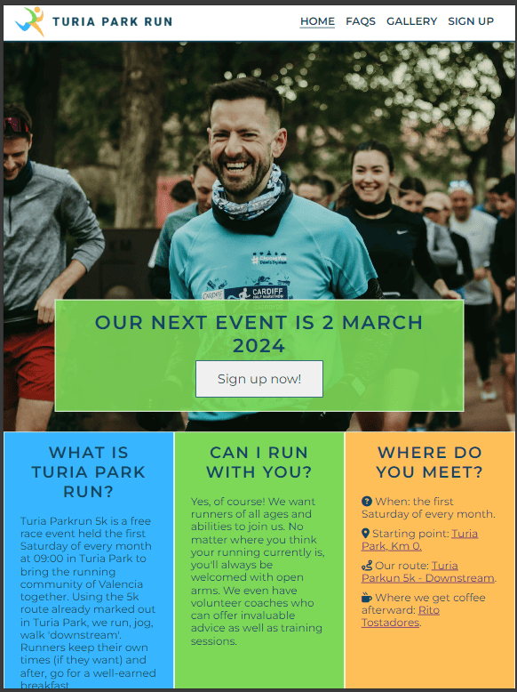
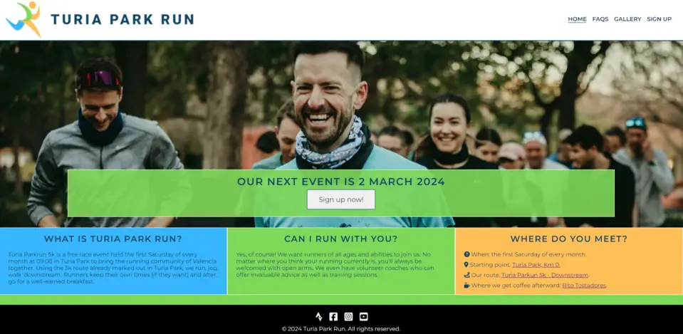
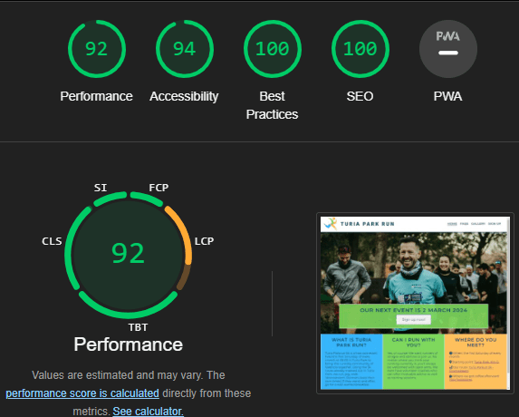

# Turia Park Run

Turia Park Run is a fully responsive website created to generate awareness of a 5k running event held monthly in the biggest park in Valencia, Spain. Everything found on this site is authentic as this is an actual fun run I currently organise myself.

The purpose of this website is to inform potential runners of the event e.g. dates, times, the meeting point, etc. as well as a call to action. In this case, it is getting the user to sign up using a form for our next race. An FAQ and gallery page provide supplementary information, which should make the decision-making process easier for the user to sign up.

[Source: https://ui.dev/amiresponsive?url=https://jdohertydev.github.io/turia-park-run/]

## Early development

* Before starting, a basic wireframe was developed using [balsamiq](https://balsamiq.com/) which helped visualise the website.

## Technologies used

* This site predominantly uses HTML, CSS and a small amount of JavaScript adapted from ['How to Create an Effective Faq Page Design with HTML and CSS'](https://www.youtube.com/watch?v=6U-8kIx2oMk).

## Features

### Navigation bar

* A unique logo and logical menu sequence appear in the navigation bar. This is consistent across all pages of the site.
* Similar to breadcrumbs, the active page link is underlined so the user always knows where they are.
* For those using a mouse, a hover-over indicates the presence of clickable links.
* For users on a smaller viewport, the page links become hidden behind a familiar 'burger' menu which maximises screen real-estate.

## Landing page 

* A hero image showing runners laughing is used to generate the user's attention.
* Centred on this image is some text in capital letters informing the user when the next event is and a 'call to action' link which takes them directly to the sign-up page.
* The opacity is set at 0.9 to ensure that the box text is clearly visible over the image.

### Information section

* This section aims to give the user all the key information in the most concise way possible. This is achieved using three simple headings with minimal text.
* The colours from the logo are used in each column to break up the text and make it more visually appealing.
* Icons that are familiar to users are used in 'Where do you meet?' as well as embedded hyperlinks that open externally to Google Maps.

### The Footer

* The footer section provides link to social media platforms.
* Icon colours match  the text from the logo for consistency.
* Icons from Font Awesome are used instead of text to create a better aesthetic look and social media platforms have been ranked in order of their most important i.e. a runner is more likely to want to link to Strava therefore this appears first.
* Boilerplate copyright information was also added.

### FAQs

* The 'frequently asked questions' aims to alleviate runners of any worries/doubts so that they are more likely to sign up.
* The questions featured are real questions that are asked monthly and the colours used are consistent with logo.
* To ensure that users know that an interaction is needed to see the answers, downward chevrons from Font Awesome have been placed at the end of each question.
* Due to the density of the information in this section, an accordion-style dropdown menu was used so the information displayed is always information that has been specifically requested by the user.
* This effect was achieved using CSS and JavaScript based on a YouTube tutorial ['How to Create an Effective Faq Page Design with HTML and CSS'](https://www.youtube.com/watch?v=6U-8kIx2oMk).
* If the user cannot find the answer to a question they have, a 'mailto' option is included in the question 'I have a different question. What can I do?'.

### The Gallery

* This page serves to 'sell' the running event by showing images of runners in a recent race.
* Both running photos and social photos have been carefully selected as the primary function of the fun run is to bring the local running community together and less about being a competitive race.
* All images have alt descriptions for accessibility and have been run through compression software to reduce loading times.
* The page is responsive and will adjust the number of columns going from 4 to 1 depending on the viewport, triggered by certain breakpoints.

### Sign-up page

* After generating awareness, interest and desire of the running event through the other pages, the purpose of the sign-up page is to affect action. 
* The user is required to enter their name, email address and also select where they heard about the event. This will help to understand how users are finding us.
* All fields are required and a valid email address (with @, .com, etc) needs to be entered by the user.

### Features left to implement

* On a fully-developed live site, I would like to have a page where runners' times are populated in a table, however this is something definitely outside of the scope of this project.

[Source: https://www.parkrun.org.uk/porthcawl/results/latestresults/]

## Testing

* This site has been tested on a Windows 11 desktop version of Chrome, Firefox and Edge. 
* Using Chrome Dev Tools, simulations of mobile and tablet viewports have also been tested with no major display errors.
* The sign-up form validates the user's email address as well as making all fields compulsory.
* All external links open in a new tab so users stay within the site and the 'noopener' attribute has also been added to protect the user.

### Screenshots of website on different devices

#### Mobile (280x653)

#### Tablet/laptop (768x1024)

#### Desktop (1920×1080)

### Bugs

#### Solved bugs
* Originally the hero image, when shown on a desktop cut the runner's head off which looked unprofessional. Thanks to some support from Code Institute, I was able to adjust this using the 'background-position' attribute.
* When checking the responsiveness of the Information Section, the 3 columns became squashed when reaching the breakpoint of mobile phones. Again, with some support from Code Institute, a media query was used to remove flex formatting which resulted in the columns stacking on top of each other – much more presentable.  
* When validating the HTML code for the FAQ page which was predominately borrowed, I kept getting the error 'Element h4 not allowed as child of element button in this context'. With some trial and error, I changed the 'button' element to 'div' and this fixed this issue.
* A similar error occurred when I tried to use a button for the 'call to action' on the first page. The error given was 'Element 'a' not allowed as child of element button in this context'. Based on some research, the advice given to fix this was to create a div that is styled in a way to look like a button, which is what I ultimately did.
* When validating the CSS, I kept returning an error 'Property text-wrap doesn't exist : nowrap'. This was fixed by changing the property to 'white-space: nowrap;'.
* Originally, the whole div inside where the logo was contained was a clickable click to get to the home page. This fix required changing the CSS code targeting the logo to display: 'inline-block;'.

### Validator testing

#### HTML and CSS

* No HTML errors are returned when passing through [The W3C Markup Validation Service](https://validator.w3.org/):
    * [index.html](https://validator.w3.org/nu/?doc=https%3A%2F%2Fjdohertydev.github.io%2Fturia-park-run%2F).
    * [faq.html](https://validator.w3.org/nu/?doc=https%3A%2F%2Fjdohertydev.github.io%2Fturia-park-run%2Ffaq.html).
    * [gallery.html](https://validator.w3.org/nu/?doc=https%3A%2F%2Fjdohertydev.github.io%2Fturia-park-run%2Fgallery.html).
    * [sign-up.html](https://validator.w3.org/nu/?doc=https%3A%2F%2Fjdohertydev.github.io%2Fturia-park-run%2Fsign-up.html).
* No CSS errors are returned when passing through [The W3C CSS Validation Service - Jigsaw](https://jigsaw.w3.org/css-validator/validator?uri=https%3A%2F%2Fjdohertydev.github.io%2Fturia-park-run%2Fassets%2Fcss%2Fstyle.css&profile=css3svg&usermedium=all&warning=1&vextwarning=&lang=en).

### Accessibility 

* This site was developed with a colour scheme that is visually appealing but also very minimal, always considering the accessibility of the user.
* All images used have an alt description attribute and the icons used for social media links use the aria-label attribute.
* Using [Lighthouse](https://developer.chrome.com/docs/lighthouse/overview), this site scored an accessibility rating of 94 and a 92-performance rating overall.

## Deployment

* This site was created using GitPod and deployed to GitHub.
    * In the GitHub repository, navigate to the Settings tab.
    * From the source section drop-down menu, select the Master Branch.
    * Once the master branch has been selected, the page will be automatically refreshed with a detailed ribbon display to indicate the successful deployment.
* The live link is [Turia Park Run](https://jdohertydev.github.io/turia-park-run/index.html).

## Credits

### Content
* This site was inspired by the Love Running walkthrough and many of the pages have used code from it. Without this resource, it would have been difficult to produce something so professional.
* The FAQ page was adapted from ['How to Create an Effective Faq Page Design with HTML and CSS'](https://www.youtube.com/watch?v=6U-8kIx2oMk).
* Advice was given by my mentor as well direct support from the Code Institute.
* To clean up the HTML and CSS [Webformatter](https://webformatter.com/) was used.

### Media

* The favicon icon based on the logo was create using [Favicon](https://favicon.io/favicon-converter/).
* Montserrat was the main font used throughout the site and this was taken from [Google Fonts]( https://fonts.google.com/).
* The author has been given permission to use all the stock photos of runners which were taken from a recent event.
* Icons that feature in the 'where?' and footer section are from [Font Awesome]( https://fontawesome.com/).
* The logo was designed by the author using [Design.com](https://www.design.com/).