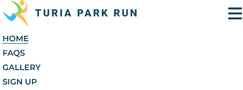
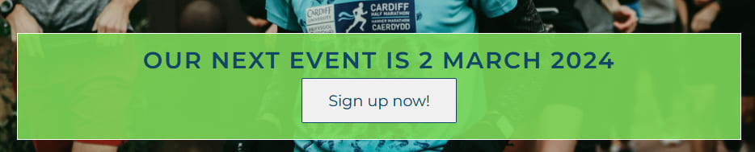
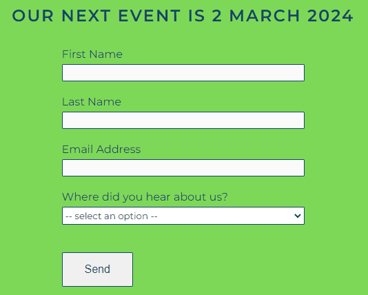

# Turia Park Run

Turia Park Run is a fully responsive website created to generate awareness of a 5k running event held monthly in the biggest park in Valencia, Spain. Everything found on this site is authentic as this is an actual fun run I currently organise myself.

The purpose of this website is to inform potential runners of the event e.g. dates, times, the meeting point, etc. as well as a call to action. In this case, it is getting the user to sign up using a form for our next race. An FAQ and gallery page provide supplementary information, which should make the decision-making process easier for the user to sign up.

[Source: https://ui.dev/amiresponsive?url=https://jdohertydev.github.io/turia-park-run/]

## Features

### Navigation bar

* A unique logo and logical menu sequence appear in the navigation bar. This is consistent across all pages of the site.
* Similar to breadcrumbs, the active page link is underlined so the user always knows where they are.
* For those using a mouse, a hover-over indicates the presence of clickable links.
* For users on a smaller viewport, the page links become hidden behind a familiar ‘burger’ menu which maximises screen real-estate.

## Landing page 

* A hero image showing runners laughing is used to generate the user's attention.
* Centred on this image is some text in capital letters informing the user when the next event is and a 'call to action' link which takes them directly to the sign-up page.

## Information section

* This section aims to give the user all the key information in the most concise way possible. This is achieved using three simple headings with minimal text.
* The colours from the logo are used in each column to break up the text and make it more visually appealing.
* Icons that are familiar to users are used in ‘Where do you meet?’ as well as embedded hyperlinks that open externally to Google Maps.

## The Footer

* The footer section provides link to social media platforms.
* Icon colours match  the text from the logo for consistency.
* Icons from Font Awesome are used instead of text to create a better aesthetic look and social media platforms have been ranked in order of their most important i.e. a runner is more likely to want to link to Strava therefore this appears first.

## FAQs

* The ‘frequently asked questions’ aims to alleviate runners of any worries/doubts so that they are more likely to sign up.
* The questions featured are real questions that are asked monthly and the colours used are consistent with logo.
* To ensure that users know that an interaction is needed to see the answers, downward chevrons from Font Awesome have been placed at the end of each question.
* Due to the density of the information in this section, an accordion-style dropdown menu was used so the information displayed is always information that has been specifically requested by the user.
* This effect was achieved using CSS and JavaScript based on a YouTube tutorial [‘How to Create an Effective Faq Page Design with HTML and CSS’](https://www.youtube.com/watch?v=6U-8kIx2oMk).
* If the user cannot find the answer to a question they have, a 'mailto' option is included in the question 'I have a different question. What can I do?'.

## The Gallery

* This page serves to ‘sell’ the running event by showing images of runners in a recent race.
* Both running photos and social photos have been carefully selected as the primary function of the fun run is to bring the local running community together and less about being a competitive race.
* All images have alt descriptions for accessibility and have been run through compression software to reduce loading times.
* The page is responsive and will adjust the number of columns going from 4 to 1 depending on the viewport, triggered by certain breakpoints.

## Sign-up page

* After generating awareness, interest and desire of the running event through the other pages, the purpose of the sign-up page is to affect action. 
* The user is required to enter their name, email address and also select where they heard about the event. This will help to understand how users are finding us.
* All fields are required and a valid email address (with @, .com, etc) needs to be entered by the user.

## Features left to implement

* On a fully-developed live site, I would like to have a page where runners’ times are populated in a table, however this is something definitely outside of the scope of this project.

[Source: https://www.parkrun.org.uk/porthcawl/results/latestresults/]

