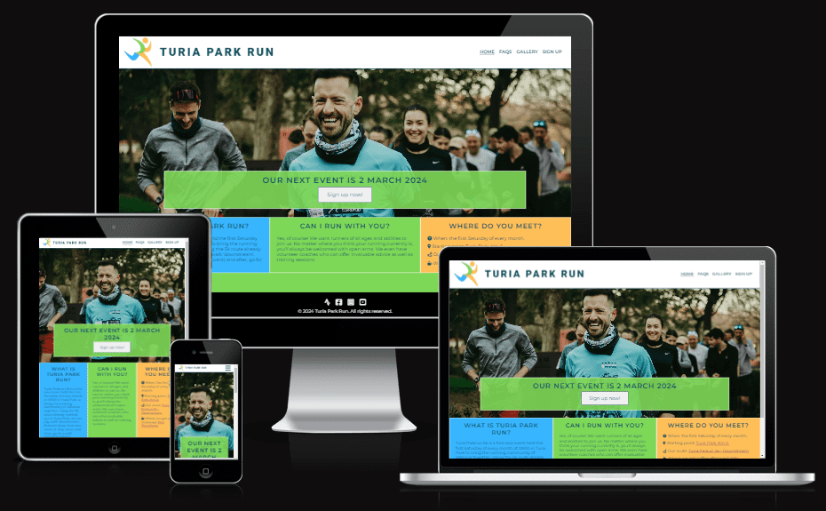

# Turia Park Run

Turia Park Run is a fully responsive website created to generate awareness of a 5k running event held monthly in the biggest park in Valencia, Spain. Everything found on this site is authentic as this is an actual fun run I currently organise myself.

The purpose of this website is to inform potential runners of the event e.g. dates, times, the meeting point, etc. as well as a call to action. In this case, it is getting the user to sign up using a form for our next race. An FAQ and gallery page provide supplementary information, which should make the decision-making process easier for the user to sign up.

[Source: https://ui.dev/amiresponsive?url=https://jdohertydev.github.io/turia-park-run/]

## Features

### Navigation bar

* A unique logo and logical menu sequence appear in the navigation bar. This is consistent across all pages of the site.
* Similar to breadcrumbs, the active page link is underlined so the user always knows where they are.
* For those using a mouse, a hover-over indicates the presence of clickable links.
* For users on a smaller viewport, the page links become hidden behind a familiar ‘burger’ menu which maximises screen real-estate.

## Landing page 

* A hero image showing runners laughing is used to generate the user's attention. 
* Centred on this image is some text in capital letters informing the user when the next event is and a 'call to action' link which takes them directly to the sign-up page.

## Information section

* This section aims to give the user all the key information in the most concise way possible. This is achieved using three simple headings with minimal text.
* The colours from the logo are used in each column to break up the text and make it more visually appealing.
* Icons that are familiar to users are used in ‘Where do you meet?’ as well as embedded hyperlinks that open externally to Google Maps.

